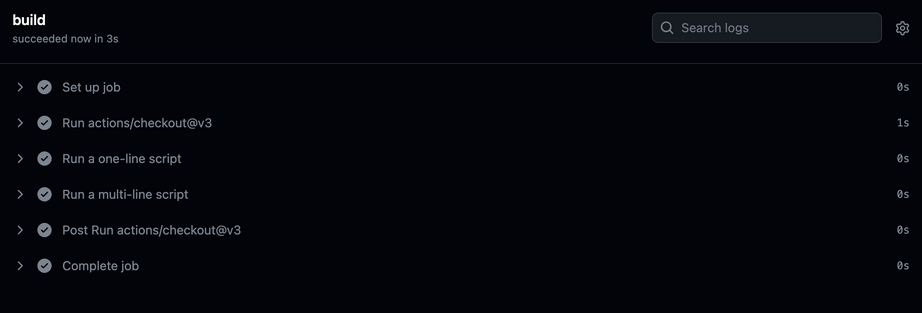
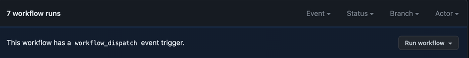

# CI/CD Lab - GitHub Actions

## Task 1: Create your First GitHub Actions Pipeline

### Observations
GitHub Actions is a powerful and flexible automation platform integrated with GitHub.
It allows developers to define custom workflows, called actions, to automate various tasks such as building, testing, and deploying projects.
Actions can be triggered on different events, such as code commits, pull requests, and issue comments.
GitHub Actions offers a wide range of pre-built actions that can be used directly or customized to suit specific needs.
Workflows are defined using YAML files (with .yml or .yaml extension) and reside in the ".github/workflows" directory of your repository.
A workflow consists of one or more jobs, and each job contains one or more steps that execute actions.
Workflows can run on different types of runners, such as GitHub-hosted runners or self-hosted runners.

### Key Concepts
**Workflows**: Automated processes defined in YAML files that run on specific events or schedules.
**Jobs**: Units of work within a workflow that run concurrently.
**Steps**: Individual tasks in a job that execute commands or actions.
**Actions**: Reusable, standalone scripts or tools that can be used in workflows.
**Runners**: The environments where workflows execute. They can be GitHub-hosted runners or self-hosted runners.

### Steps
**Create a new repository:** I created a new repository on GitHub.
**Create a workflow file:** I created a new directory named ".github/workflows" and added a YAML file named "main.yml" inside it. This is where we define our workflow.
**Define the workflow:** In the "main.yml" file, I defined a simple workflow that runs on every push event to the main branch. The workflow has one job named "say_hello," and it consists of a single step that prints "Hello, GitHub Actions!" to the console.
**Commit and push changes:** I committed the changes and pushed them to the "main" branch of my GitHub repository.
**Verify the workflow:** After the push, I navigated to the "Actions" tab on my GitHub repository. I could see the workflow listed and running on the latest commit.
**View the workflow run:** Clicking on the workflow run, I was able to see the details of the job and the step. The step output showed "Hello, GitHub Actions!" as expected.


I created the workflow as following:
```sh
# This is a basic workflow to help you get started with Actions

name: CI

# Controls when the workflow will run
on:
  # Triggers the workflow on push or pull request events but only for the "main" branch
  push:
    branches: [ "main" ]


# A workflow run is made up of one or more jobs that can run sequentially or in parallel
jobs:
  # This workflow contains a single job called "build"
  build:
    # The type of runner that the job will run on
    runs-on: ubuntu-latest

    # Steps represent a sequence of tasks that will be executed as part of the job
    steps:

      - name: Run a one-line script
        run: echo Hello, world!

```

**Output:**





## Task 2: Gathering System Information and Manual Triggering

For manual trigger we can add the following code to the workflow:

> #Allows you to run this workflow manually from the Actions tab
> workflow_dispatch:

The the following option should be available:





